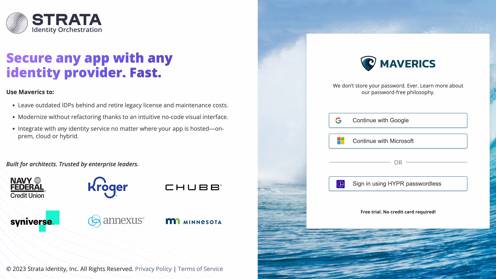
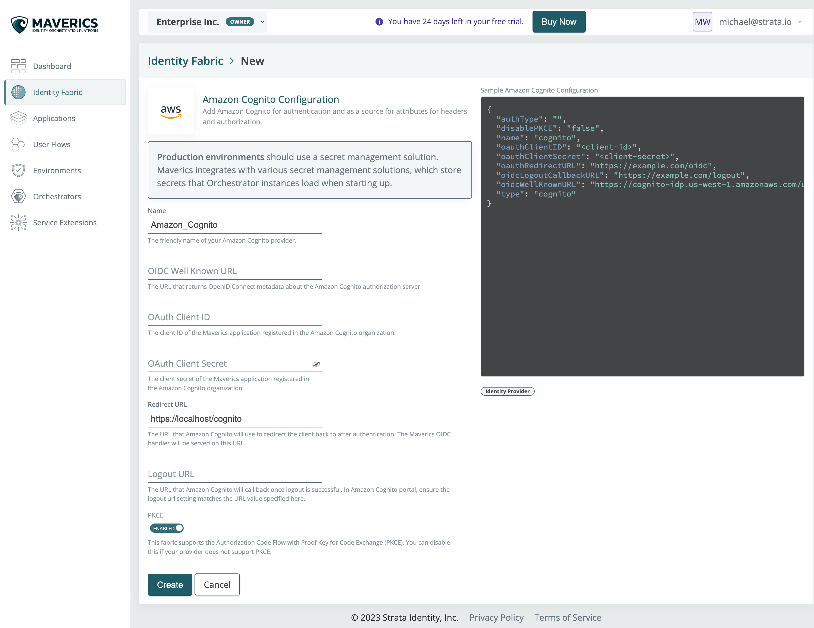
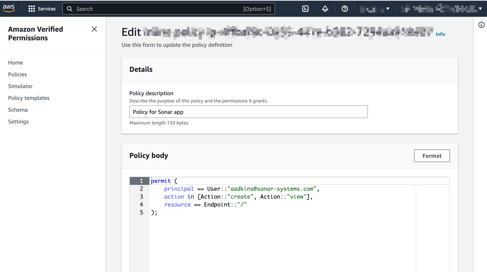
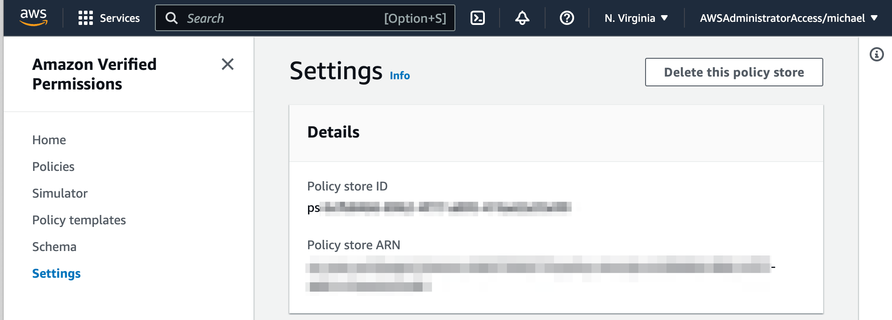
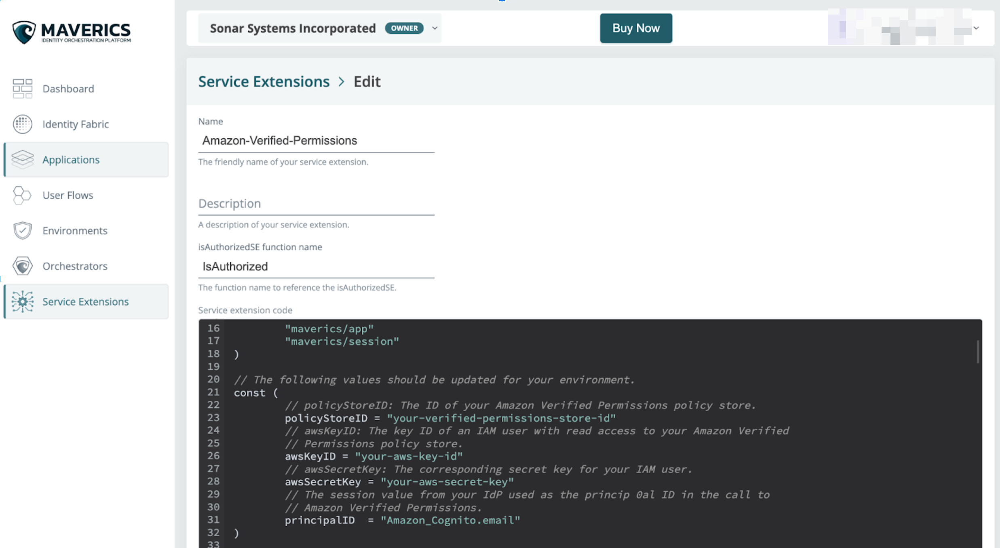
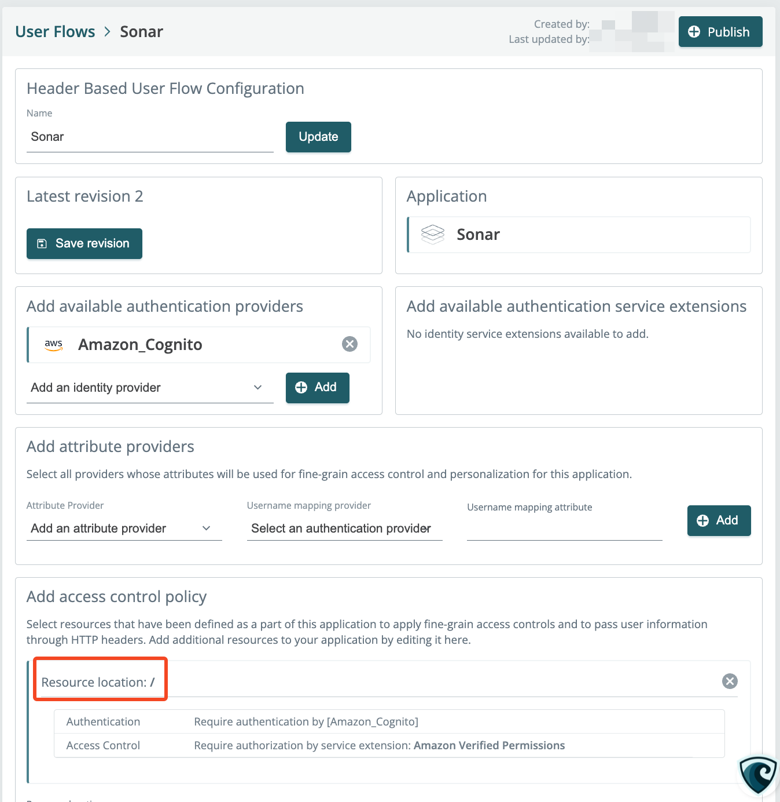
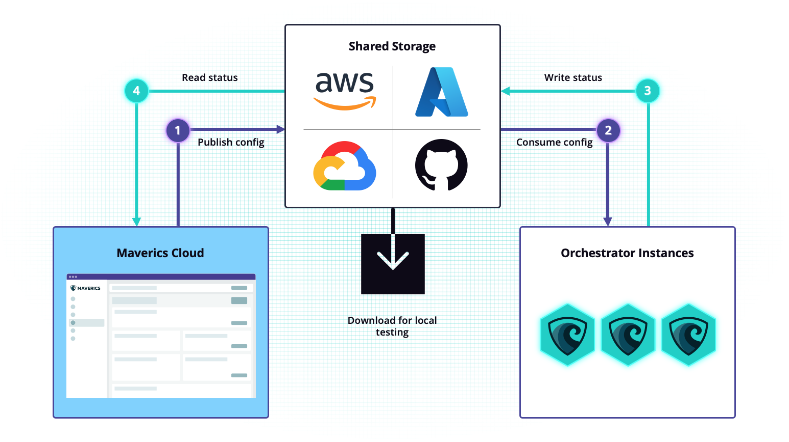
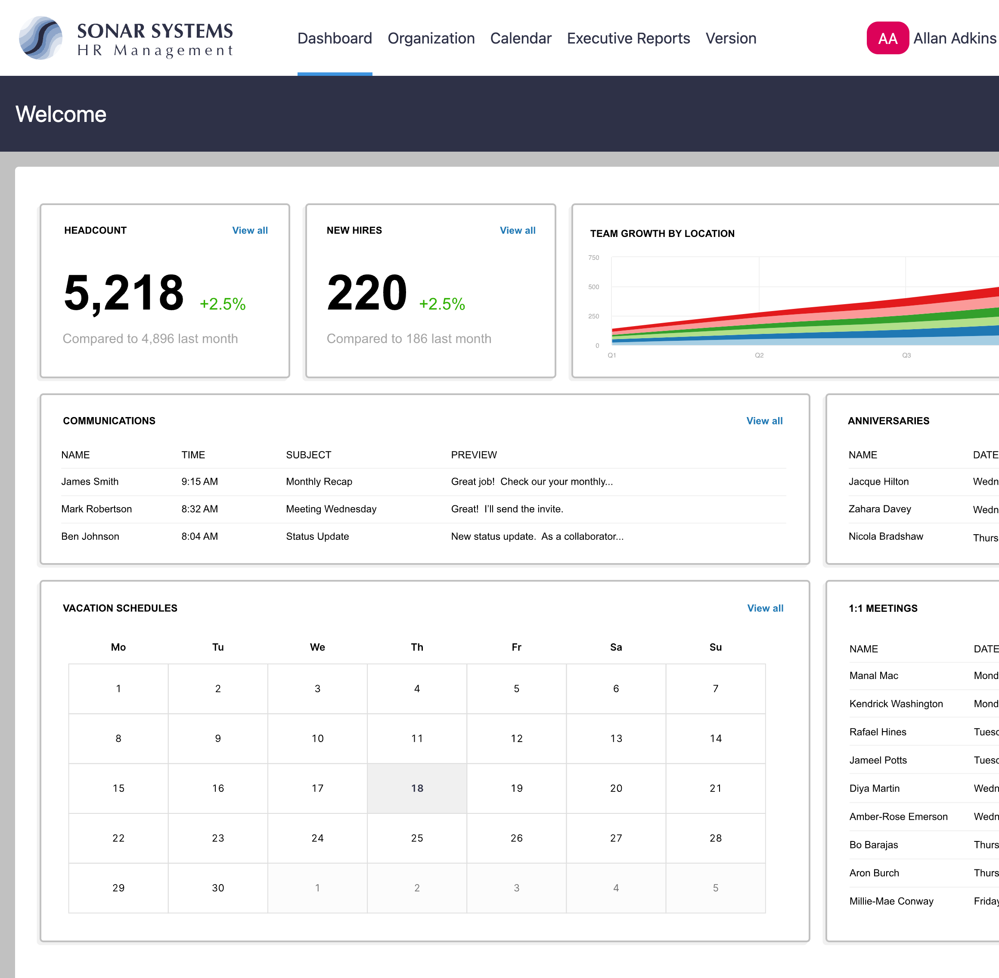
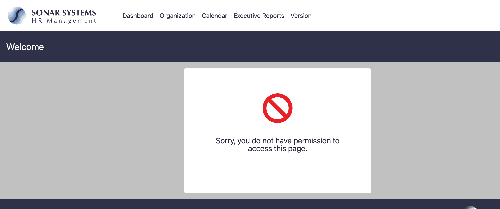

# Amazon Verified Permissions Quick Start Guide

In this guide, we will show you how you can use Maverics to modernize a legacy application with Amazon Cognito for authentication and Amazon Verified Permissions for authorization. With Maverics you can create a new identity fabric for your applications without having to update the application's code.

This repository includes everything you need to pull it all together. The scenario is based on Sonar, a non-standard application that does not understand modern identity protocols. Currently, Sonar relies on a legacy identity provider (IdP) called SiteMinder. Maverics is flexible, and this process works with a modern app or identity system migration as well.

In this this repository you will find:

* [Amazon_Recipe.json](https://github.com/strata-io/strata-service-extension-examples/blob/main/amazon-verfied-permissions/Amazon_Recipe.json): The custom configuration that will be copied to Maverics.
* [amazon-verified-permissions.go](https://github.com/strata-io/strata-service-extension-examples/blob/main/amazon-verfied-permissions/amazon-verified-permissions.go): The code for the service extension that will connect your user flow to your Amazon Verified Permissions policy.
* A local environment configuration and self signed keys to run an orchestrator:
  * [maverics.env](https://github.com/strata-io/strata-service-extension-examples/blob/main/amazon-verfied-permissions/maverics.env)
  * [localhost.crt](https://github.com/strata-io/strata-service-extension-examples/blob/main/amazon-verfied-permissions/localhost.crt)
  * [localhost.key](https://github.com/strata-io/strata-service-extension-examples/blob/main/amazon-verfied-permissions/localhost.key)

This guide will take you 45 minutes to an hour to complete.

## Sign up for Maverics

First, sign up for the Maverics Identity Orchestration Platform at [http://maverics.strata.io](http://maverics.strata.io). You can sign up with HYPR, Google, or Microsoft Azure SSO.



After signing up for an account, you will land on the Dashboard. You can then set up your orchestrator, environment, identity fabric, and user flow using the buttons on the screen or left navigation.

## Import the demo Orchestration Recipe

When we mix and match multiple identity services to build out end-to-end user journeys, we call them Orchestration Recipes. Using this Recipe, we will deploy a user flow for a non-standard header-based demo application called Sonar.

To upload this recipe:

1. Go to the dashboard and click the **Import Identity Orchestration Recipe** button at the top of the screen.
2. From the Import screen, enter `Sonar` as the name for the user flow.
3. Copy the code from [Amazon-Recipe.json](https://github.com/strata-io/strata-service-extension-examples/blob/main/amazon-verfied-permissions/Amazon_Recipe.json) and paste it into the Configuration text box.
4. Click **Create**.

Now that you’ve created a configuration with the default Recipe, the configuration details will appear in Maverics. Go to the dashboard from the left navigation and confirm the following:

* **Identity Fabric**: Your identity fabric is a collection of all the identity services that you use with your apps. You can choose a variety of different identity services to use such as an IDP, passwordless, or a user attribute provider. Here you will see *Amazon_Cognito* will be used as the primary IDP.
* **Applications**: Applications are the resources and tools your users access. *Sonar* is a non-standards-based app that relies on headers for personalization and authorization decisions. We will proxy this application to modernize it. This application has multiple resources we will protect with access policies that are defined in the User Flow.
* **User Flows**: *Sonar Flow* appears under User Flows. The user flow defines the experience users will have when they go to access it.
  * Select *Sonar Flow*. In this overview, you will note that the flow uses Amazon Cognito for authentication, and there are access policies on each of the application’s resources.

## Set up Cognito for authentication

The first step we will take to modernize *Sonar* is to use Amazon Cognito for authentication. In this section, you will create a Cognito user pool with an app client for Sonar, as well as a test user. You will then input configuration details into Maverics to complete the setup.

First, from Cognito in your AWS console, follow steps 1 and 2 in Amazon's [Cognito Getting Started Guide](https://docs.aws.amazon.com/cognito/latest/developerguide/getting-started-with-cognito-user-pools.html) to create a user pool and add an app client.

When setting up the user pool, we recommend leaving all of the options at their default setting **except** for the following:

1. On the Configure sign-in experience page, select **Email** as the sign-in option.
2. On the Integrate your app section:

   * Under Hosted authentication pages, select **Use the Cognito Hosted UI**.
   * Choose a Cognito domain prefix, e.g., *strata-maverics-sonar-app*.
   * Under Initial app client, select **Other - A custom app. Choose your own grant, auth flow, and client-secret settings.**
   * Enter an app name, like *Sonar-app*.
   * Ensure **Generate a client secret** is selected under Client secret.
   * Under **Allowed callback URLs**, enter `https://localhost/oidc`
   * Ensure that the **OpenID Connect scopes** field contains `email`, `openid`, and `profile`.

3. Scroll to the bottom and click **Create user pool**.
4. After you have created the user pool and you have been redirected to the User pools page, click the user pool you have just created.
5. Make a note of the **User Pool ID** and **AWS region**.
6. Go to the App integration tab and scroll down to the App client list. Click the app name.
7. On the app client page, copy the **Client ID** and **Client secret**.
8. Go back to the user pool page. In the **Users** section, click **Create user** and follow the instructions.
9. Make a note of the email address you used for the username, as this will be the user that is granted permissions by the Amazon Verified Permissions policy in the next section.

## Configure Maverics to use your Amazon Cognito User Pool as the IDP

Return to Maverics. Click [Identity fabric](https://maverics.strata.io/identity_fabric_components) in the left navigation, and select Amazon_Cognito.



Update the following fields:

* **OIDC Well Known URL** - Replace `<AWS region>` with the AWS region code where your user pool is located (e.g., us-east-1) and `<UserPoolId>` with the actual ID of your user pool.

  `https://cognito-idp.<AWS region>.amazonaws.com/<UserPoolId>/.well-known/openid-configuration`
* **OAuth Client ID** - Enter the client ID of the Maverics application registered in the Amazon Cognito user pool.
* **OAuth Client Secret** - Enter the client secret of the Maverics application registered in the Amazon Cognito user pool.

Click **Update** to save your changes.

## Create the Amazon Verified Permissions policy

For the next step in modernization, we will add Amazon Verified Permissions to your identity fabric for authorization. In these steps, we will create an Amazon Verified Permissions policy store, a policy in Cedar, as well as an IAM user to access the policy.



1. First, go to **Amazon Verified Permissions** within your AWS console.
2. Create a policy store by clicking **Create policy store**. Please refer to the [Amazon Verified Permissions documentation](https://docs.aws.amazon.com/verifiedpermissions/latest/userguide) for more information on policy stores.
3. Create a policy written in [Cedar](https://www.cedarpolicy.com/en) - open-source language for defining permissions as policies. Please refer to the [Amazon Verified Permissions documentation](https://docs.aws.amazon.com/verifiedpermissions/latest/userguide) for more information on policy creation.
4. Use the policy available below. This policy will allow the test user to create and view resources at the root endpoint. Replace the user `placeholder` value below with the email address of your test user in your Cognito user pool.

```cedar
permit (
    principal == User::"placeholder",
    action in [Action::"create", Action::"view"],
    resource == Endpoint::"/"
);
```

5. Click Settings in the sidebar of Amazon Verified Permissions. Make a note of the Policy Store ID, as this will be used in the service extension.



## Configure the service extension in Maverics

In these steps we will use a Maverics service extension to call Amazon Verified Permissions to enforce the example Cedar policy.

1. In Maverics, go to the [Service Extensions page](https://maverics.strata.io/service_extensions) from the left navigation in Maverics, and select **Authorization Service Extension**.
2. Enter the name, e.g., `Amazon-Verified-Permissions`, and click **Create**.
3. When you click Create, the service extension code box appears. Paste the code copied from the [amazon-verified-permissions.go](https://github.com/strata-io/strata-service-extension-examples/blob/main/amazon-verfied-permissions/amazon-verified-permissions.go) file.
4. Follow the instructions in the code to replace:

* `policyStoreID` - ID of your Amazon Verified Permissions Store
* `region` - the region where your Amazon Verified Permissions policy store is located



5. Let's associate this Service Extension with the Amazon_Cognito identity fabric. At the top right section of the screen under Providers, select your Amazon_Cognito identity provider instance and click **Add**.
6. Click **Update** to save your service extension.

## Update the user flow access policy to use Amazon Verified Permissions

From here, you can now complete the setup of your app's user flow.

1. Go to the User flows page from the left navigation.
2. Click **Sonar flow**, and scroll down to the **Add access control policy** section.
3. Click **Resource location: /** to edit the root resource policy.
   
4. You will then be prompted to configure access control. Under Access Controls, select **Use service extension: Amazon Verified Permissions policy**.
5. Click **Update**, then click **Back** to return to the Sonar Flow.
6. In the Latest Revision section, the indicator should notify you that your user flow has been updated. Click **Save Revision**.

## Create a local environment for testing



Environments enable a hybrid air gap approach where there is no dependency between your own environments, applications, and identity services with Maverics.

With Maverics as your control plane, you will deploy a signed config to a cloud storage provider, and configure the orchestrators running in your environment to remotely read the config from the container.

To publish the Sonar user flow to an orchestrator and test it, we need a local environment. This includes permissions to use your Verified Permissions policy, a public key pairing, and a configuration to connect an orchestrator.  Finally, to test the user flow you will run the test app Sonar as a Docker container.

## Set permissions to enable use of your Verified Permissions policies

The orchestrator supports defining an AWS credential as an environment variable. In this local scenario, we will create a policy and an IAM principal user's credentials for the orchestrator to use. In a production scenario, your environment (for example, in EC2) can turn these credentials into temporary credentials.

1. Go to **Identity and Access Management (IAM)** within your AWS console.
2. Under Access management, go to **Policies**.
3. Click **Create policy**.
4. Click **JSON** to go to the JSON policy editor.
5. Copy the code block below and paste it in the editor, replacing everything in the editor.

```json
{
    "Version": "2012-10-17",
    "Statement": [
        {
            "Effect": "Allow",
            "Action": [
                "verifiedpermissions:*"
            ],
            "Resource": "*"
        }
    ]
}
```

6. Click **Next**.
7. Enter a policy name (for example, `Sonar`), and click **Create policy**.

Next, let's create an IAM principal to be used by Maverics. Refer to the [create a separate IAM user](https://docs.aws.amazon.com/IAM/latest/UserGuide/id_users_create.html) documentation for more information.

1. Go to **Identity and Access Management (IAM)** within your AWS console.
2. Under Access management, go to **Users**.
3. Click **Add users**.
4. Give the user a name and click **Next**.
5. On the Set permissions page, select **Attach policies directly**, and search for *Sonar* (or the policy you have just created).
6. Select the policy checkbox and click **Next**.
7. Click **Create user**.
8. After the user has been created, you are redirected to the users list. Click the name of the user you have just created.
9. Click **Security credentials**.
10. Scroll down to Access keys and click **Create access key**.
11. Select **Application running outside AWS** and click **Next**.
12. You can set a description tag or leave it blank, and click **Create access key**.
13. On the Retrieve access keys page, copy the **Access key** and **Secret access key**, and keep them in a safe place. Alternatively, you can download the .csv file. These will be used in the orchestrator environment variables to access Amazon Verified Permissions.
14. Click **Done**.

## Create a local environment

1. From the sidebar, go to [Environments](https://maverics.strata.io/environments) and click the **+ icon** next to **Local**.
2. Configure the following:
   * **Name**: A friendly name for your environment. For this example, let’s use `local-environment`.
   * **Description**: Optional description of the environment.
3. Click **Create**. The details of your environment appear on the next page.

## Configure an orchestrator to read the signed configuration

To continue this setup, you will need to download the following files to a directory on your machine:

* [**maverics.env**](https://github.com/strata-io/strata-service-extension-examples/blob/main/amazon-verfied-permissions/maverics.env): The file for your local environment
* **Self-signed certs**:  PEM encoded key pair provided for the inbound TLS to the orchestrator's HTTP server
  * [**localhost.cer**](https://github.com/strata-io/strata-service-extension-examples/blob/main/amazon-verfied-permissions/localhost.crt)
  * [**localhost.key**](https://github.com/strata-io/strata-service-extension-examples/blob/main/amazon-verfied-permissions/localhost.key)

1. On the [Environments page](https://maverics.strata.io/environments), click the Local environment you created.
2. Download the orchestrator appropriate for your operating system from the **Download orchestrator** section. Save this file to your local working directory, and [follow our instructions](https://docs.strata.io/set-up-maverics/configure-orchestrators) to install based on your operating system.
3. Additionally, download the public key .pem file for your local environment from the section labeled **Download Public Key.** Save this to your local working directory.
4. Open the maverics.env file you downloaded earlier.

```bash
export MAVERICS_RELOAD_CONFIG=true
export MAVERICS_POLLING_INTERVAL_SECONDS=30
export MAVERICS_DEBUG_MODE=true
export MAVERICS_HTTP_ADDRESS=":443"
export MAVERICS_TLS_SERVER_CERT_FILE="./localhost.crt"
export MAVERICS_TLS_SERVER_KEY_FILE="./localhost.key"
export MAVERICS_BUNDLE_PUBLIC_KEY_FILE=./local-environment_public_key.pem
export AWS_ACCESS_KEY_ID=
export AWS_SECRET_ACCESS_KEY=
```

This environment file configures the following settings:

* `MAVERICS_RELOAD_CONFIG`: this setting turns on auto-reload
* `MAVERICS_POLLING_INTERVAL_SECONDS`: the interval in seconds to poll for configuration updates
* `MAVERICS_DEBUG_MODE`: more verbose logging
* `MAVERICS_HTTP_ADDRESS`: the http address where Maverics is running on your local machine
* `MAVERICS_TLS_SERVER_CERT_FILE`: the path to the cert file
* `MAVERICS_TLS_SERVER_KEY_FILE`: the path to the TLS key file
* `MAVERICS_BUNDLE_PUBLIC_KEY_FILE`: the working directory path to the .pem-encoded key file that supports the configuration bundle signature verification
* `AWS_ACCESS_KEY_ID`: the IAM user principal to enable orchestrators running in your environment  to use your Verified Permissions policy
* `AWS_SECRET_ACCESS_KEY`:the IAM user principal's secret access key

5. Update the `MAVERICS_BUNDLE_PUBLIC_KEY_FILE=` value to the file name of the .pem file you downloaded and save the .env file.

The orchestrator instance will then attempt to read the configuration from your local storage, but it will fail until you have deployed the orchestrator in the next section.

6. Update the `AWS_ACCESS_KEY_ID` and `AWS_SECRET_ACCESS_KEY` with the IAM Principal credentials created from the previous section.

## Install the Sonar demo app

Sonar is an application provided by Strata to demonstrate the user flow. The app is stored in a Docker container and can be run with the following steps:

1. Go to [Docker.com](https://docker.com) and download the version of Docker Desktop for your operating system.
2. Follow the steps to install Docker Desktop.
3. After installation, open a command prompt and run the following command to download and run the Sonar demo app:
   `docker run -p 8987:8987 strataidentity/sonar sonar`

## Deploy the user flow to your local environment

1. Go back to your [User Flows in Maverics](https://maverics.strata.io/user_flows) and open *Sonar Flow*.
2. Click **Publish** to create a new deployment.
3. On the Publish screen, select the local environment you created and click **Publish**. A confirmation message will appear in the lower right corner, but you will stay on the Publish page. At the top of the screen, the Environments list will reflect that your configuration has been deployed.
4. From this list, click **Download** under the Deployed Bundle column. Save the maverics.tar.gz to your working directory. Please note that if you navigate away from this page, you can always go to the [Environments section](https://maverics.strata.io/environments), select your local environment, and click the **Download configuration** button.

## Start an orchestrator to read your deployed user flow

From the steps we completed in the previous section, our last step is to start an orchestrator instance to read your configuration. We need to give the orchestrator a path to the configuration bundle, environment variables on how it will behave, and a command to launch it.

From the Terminal, start the orchestrator with the following command:

```bash
source /path/to/your/working/directory/maverics.env && ./maverics_darwin_amd64 -config /path/to/your/working/directory/maverics.tar.gz
```

* `source` path to the *maverics.env* file you edited
* `config` path to the *maverics.tar.gz* file you downloaded

## Try out the Recipe with the test user

Testing your user flow ensures that Maverics is working as expected and has passed through the correct headers. You can test your user flow by logging into the Sonar app.

1. Open a browser window to access the Sonar app at [https://localhost](https://localhost)
2. Login your test user username and password
3. This user should be permitted to access the resource.
   
4. Go to the Amazon Verified Permissions policy page and change the policy from `permit` to `forbid` and save the policy.
5. Open an incognito browser window and repeat steps 1 and 2.
   
6. The user should now be denied now that the policy has been changed.

To see this in action and for instructions on how to test your user flows, watch our [demonstration video](https://www.youtube.com/watch?v=RMGmENc3TGU) of the complete app modernization process. For more detailed information on setting up Maverics, view our documentation at [docs.strata.io](https://docs.strata.io).
