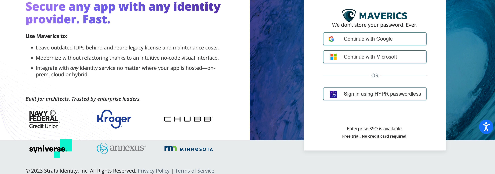
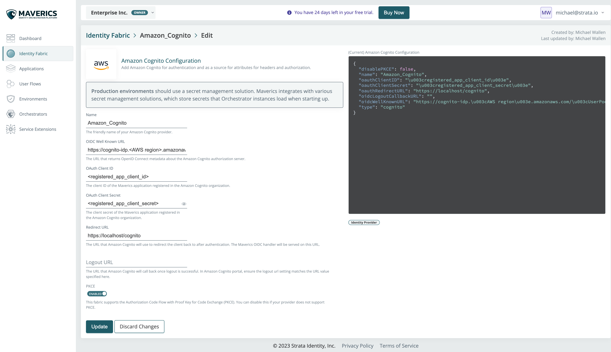
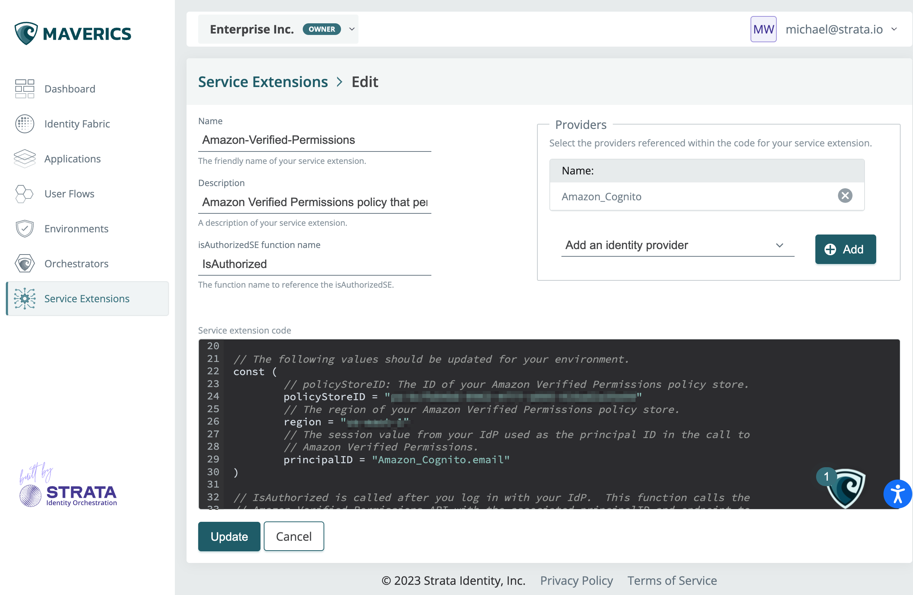

# Amazon Verified Permissions Quick Start Guide

In this guide, we will show you how you can use Maverics to modernize a legacy application with Amazon Cognito for authentication and Amazon Verified Permissions for authorization. With Maverics you can create a new identity fabric for your applications without having to update the application's code.

This repository includes everything you need to pull it all together. The scenario is based on Sonar, a non-standard application that does not understand modern identity protocols. Currently, Sonar relies on a legacy identity provider (IdP) called SiteMinder. Maverics is flexible, and this process works with a modern app or identity system migration as well.

In this this repository you will find:

* **Amazon_Recipe.json**: The custom configuration that will be copied to Maverics.
* **amazon-verified-permissions.go**: The code for the service extension that will connect your user flow to your Amazon Verified Permissions policy.
* A local environment configuration and self signed keys to run an Orchestrator:
  * **maverics.env**
  * **localhost.cer**
  * **localhost.key**

This guide will take you 45 minutes to an hour to complete.

## Sign up for Maverics

First, sign up for the Maverics Identity Orchestration Platform at [http://maverics.strata.io](http://maverics.strata.io). You can sign up with HYPR, Google, or Microsoft Azure SSO.



After signing up for an account, you'll land on the Dashboard. You can then set up your orchestrator, environment, identity fabric, and user flow using the buttons on the screen or left navigation.

## Import the demo Orchestration Recipe

When we mix and match multiple identity services to build out end-to-end user journeys, we call them Orchestration Recipes. Using this Recipe, we'll deploy a user flow for a non-standard header-based demo application called Sonar.

To upload this recipe:

1. Go to the dashboard and click the **Import Identity Orchestration Recipe** button at the top of the screen.
2. From the Import screen, enter Sonar as the name for the user flow.
3. Copy the code from **Amazon-Recipe.json** and paste it into the Configuration text box.
4. Click **Create**.

Now that you’ve created a configuration with the default Recipe, the configuration details will appear in Maverics. Go to the dashboard from the left navigation and confirm the following:

* **Identity Fabric**: Your identity fabric is a collection of all the identity services that you use with your apps. You can choose a variety of different identity services to use as an IDP, passwordless, or a user attribute provider. Here you will see Amazon_Cognito will be used as the primary IDP.
* **Applications**: Applications are the resources and tools your users access. Sonar is a non-standards-based app that relies on headers for personalization and authorization decisions. We will proxy this application to modernize it. This application has multiple resources we will protect with access policies that are defined in the User Flow.
* **User Flows**: Sonar Flow appears under User Flows. The user flow defines the experience users will have when they go to access it.
  * Select **Sonar Flow**. In this overview, you will note that the flow uses Amazon Cognito for authentication, and there are access policies on each of the application’s resources.

## Set up Cognito for authentication

The first step we'll take to modernize Sonar is to use Amazon Cognito for authentication. In this section, you'll create a Cognito user pool with an app client for Sonar, as well as a test user. You'll then input configuration details into Maverics to complete the setup.

First, from Cognito in your AWS console, follow steps 1 and 2 in Amazon's [Cognito Getting Started Guide](https://docs.aws.amazon.com/cognito/latest/developerguide/getting-started-with-cognito-user-pools.html) to create a user pool and add an app client.

When setting up the user pool, we recommend leaving all of the options at their default setting **except** for the following:

1. On the Configure sign-in experience page, select **Email** as the sign-in option.
2. On the Integrate your app section:

* Under Hosted authentication pages, select **Use the Cognito Hosted UI**.
* Under Initial app client, select **Confidential client**.
* Enter an app name, like *Sonar-app*.
* Ensure **Generate a client secret** is selected under Client secret.
* Under Allowed callback URLs, enter `https://localhost/oidc`

3. Scroll to the bottom and click **Create user pool**.

After you've created the user pool and you've been redirected to the User pools page, click the user pool you've just created.

Make a note of the **User Pool ID** and **AWS region**. Go to the App integration tab and scroll down to the App client list. Click the app name, and on the app client page, copy the **Client ID** and **Client secret**.

In the **Users** section, click the **Create user** button and follow the instructions. Make a note of the email address you used for the username.

### Configure Maverics to use your Amazon Cognito User Pool as the IDP

Return to Maverics at https://maverics.strata.io. Click [Identity fabric](https://maverics.strata.io/identity_fabric_components) in the left navigation, and select Amazon_Cognito.



Update the following fields:

* **OIDC Well Known URL** - Replace `<AWS region>` with the AWS region code where your user pool is located (e.g., us-east-1) and `<UserPoolId>` with the actual ID of your user pool.

  `https://cognito-idp.<AWS region>.amazonaws.com/<UserPoolId>/.well-known/openid-configuration`
* **OAuth Client ID** - Enter the client ID of the Maverics application registered in the Amazon Cognito user pool.
* **OAuth Client Secret** - Enter the client secret of the Maverics application registered in the Amazon Cognito user pool.

## Create the Amazon Verified Permissions policy and IAM user

For the next step in modernization, we'll add Amazon Verified Permissions to your identity fabric for authorization. In these steps, we'll create an Amazon Verified Permissions policy in Cedar, as well as an IAM user to access the policy.


1. First, go to **Amazon Verified Permissions** within your AWS console.
2. Create a policy using the [Cedar policy language](https://www.cedarpolicy.com/en/tutorial). (Links to the Amazon Verified Permissions docs available soon)
3. Use the policy available below. This policy permits view and create access to the root resource on your application.
4. Replace the `User` value below with the email address of your test user in your Cognito user pool.

```
permit (
principal == User::"placeholder",
action in [Action::"create", Action::"view"],
resource == Endpoint::"/"
);
```


5. Click Settings in the sidebar of Amazon Verified Permissions. Make a note of the Policy Store ID, as this will be used in the service extension.

Next, you will need to you will need to create an access policy for your IAM user.

1. Go to **Identity and Access Management (IAM)** within your AWS console. 
2. Under Access management, go to **Policies**.
3. Click **Create policy**.
4. Click **JSON** to go to the JSON policy editor. 
5. Copy the code block below and paste it in the editor, replacing everything in the editor.
```
{
    "Version": "2012-10-17",
    "Statement": [
        {
            "Effect": "Allow",
            "Action": [
                "verifiedpermissions:*"
            ],
            "Resource": "*"
        }
    ]
}
```
6. Click **Next**.
7. Enter a policy name (for example, *Sonar*), and click **Create policy**.

Finally, you must [create a separate IAM user](https://docs.aws.amazon.com/IAM/latest/UserGuide/id_users_create.html) to access this policy. 

1. Go to **Identity and Access Management (IAM)** within your AWS console. 
2. Under Access management, go to **Users**.
3. Click **Add users**.
4. Give the user a name and click **Next**.
5. On the Set permissions page, select **Attach policies directly**, and search for Sonar (or the policy you've just created).
6. Select the policy checkbox and click **Next**.
7. Click **Create user**.
8. After the user has been created, you are redirected to the users list. Click the name of the user you've just created
9. Click **Security credentials**.
10. Scroll down to Access keys and click **Create access key**.
11. Select **Application running outside AWS** and click **Next**.
12. You can set a descritpion tag or leave it blank and click **Next**.
13. On the Retrieve access keys page, copy the **Access key** and **Secret access key**, and keep them in a safe place. Alternatively, you can download the .csv file. These will be used in the service extension.
14. Click **Done**.

## Configure the service extension in Maverics

In these steps we will use a Maverics service extension to call Amazon Verified Permissions to enforce the example Cedar policy.

1. First, open [**amazon-verified-permissions.go** from Github](https://github.com/strata-io/strata-service-extension-examples/blob/main/amazon-verfied-permissions/amazon-verified-permissions.go) and copy the raw code.
2. In Maverics go to the [Service Extensions page](https://maverics.strata.io/service_extensions) from the left navigation in Maverics, and select **Authorization Service Extension**.
3. Enter the name below and click **Create**:

```
Amazon-Verified-Permissions
```

4. When you click Create, the service extension code box appears. Paste the code copied from the **amazon-verified-permissions.go** file.
5. Follow the instructions in the code to replace:

* `policyStoreID` - ID of your Amazon Verified Permissions Store
* `awsKeyID` - the ID of an IAM user with read access to your Amazon Verified Permissions Policy
* `awsSecretKey` - the corresponding secret key for your IAM user



1. Now we'll associate this Service Extension with the Amazon_Cognito identity fabric. At the top right section of the screen under Providers, select your Amazon_Cognito identity provider instance and click **Add**.
2. Click **Update** to save your service extension.

## Update the user flow access policy to use Amazon Verified Permissions

From here, you can now complete the setup of your app's user flow.

1. Go to the User flows page from the left navigation.
2. Click **Sonar flow**, and scroll down to the **Add access control policy** section.
3. Click **Resource location: /** to edit the root resource policy.
   
4. You will then be prompted to configure access control. Under Access Controls, select **Use service extension: Amazon Verified Permissions policy**.
5. Click **Update**, then click **Back** to return to the Sonar Flow.
6. In the Latest Revision section, the indicator should notify you that your user flow has been updated. Click **Save Revision**.

## Create a local environment for testing


Environments enable a hybrid air gap approach where there is no dependency between your own environments, applications, and identity services with Maverics.

With Maverics as your control plane, you deploy signed config to a cloud storage provider and configure orchestrators running in your environment to remotely read that from the container.

Maverics deploys securely signed configuration bundles that are unique to each environment. Orchestrators validate these bundles with the environment’s public key as they are read. If the validation fails, the orchestrator will not consume it. This ensures that the configuration has not been tampered with by bad actors.

In this section, we will create a local environment, get the public key, and configure an orchestrator that can validate the signature of any configuration deployed to this environment. This will enable us to publish the Sonar user flow to an orchestrator. Finally, to test the user flow you will run Sonar as a Docker container.

1. From the sidebar, go to Environments and click the **+ icon** next to Local.
2. Configure the following:
   * **Name**: A friendly name for your environment. For this example, let’s use local-environment.
   * **Description**: Additional description of the environment.
3. Click **Create**. The details of your environment appear on the next page.

## Configure an orchestrator to read the signed configuration

To continue this setup, you will need to download the following files to a directory on your machine:

* [**maverics.env**](https://github.com/strata-io/strata-service-extension-examples/blob/main/amazon-verfied-permissions/maverics.env): The file for your local environment
* **Self-signed certs**:  PEM encoded key pair provided for the inbound TLS to the orchestrator's HTTP server
  * [**localhost.cer**](https://github.com/strata-io/strata-service-extension-examples/blob/main/amazon-verfied-permissions/localhost.crt)
  * [**localhost.key**](https://github.com/strata-io/strata-service-extension-examples/blob/main/amazon-verfied-permissions/localhost.key)

1. Download the orchestrator appropriate for your operating system from the Download Orchestrator section. Save this file to your local working directory, and [follow our instructions](https://docs.strata.io/set-up-maverics/configure-orchestrators) to install based on your operating system.
2. Additionally, download the public key .pem file for your local environment from the section labeled **Download Public Key.** Save this to your local working directory.
3. Open the maverics.env file you downloaded earlier.

```
export MAVERICS_RELOAD_CONFIG=true
export MAVERICS_DEBUG_MODE=true
export MAVERICS_HTTP_ADDRESS=":443"
export MAVERICS_BUNDLE_PUBLIC_KEY_FILE=./<environment>_public_key.pem
export MAVERICS_TLS_SERVER_CERT_FILE=./localhost.crt
export MAVERICS_TLS_SERVER_KEY_FILE=./localhost.key
```

This environment file configures the following settings:

* `MAVERICS_RELOAD_CONFIG`: this setting turns on auto-reload
* `MAVERICS_DEBUG_MODE`: more verbose logging
* `MAVERICS_HTTP_ADDRESS`: the http address where Maverics is running on your local machine
* `MAVERICS_BUNDLE_PUBLIC_KEY_FILE`: the working directory path to the .pem-encoded key file that supports the configuration bundle signature verification
* `MAVERICS_TLS_SERVER_CERT_FILE`: the path to the cert file
* `MAVERICS_TLS_SERVER_KEY_FILE`: the path to the TLS key file

4. Update the `MAVERICS_BUNDLE_PUBLIC_KEY_FILE=` value to the file name of the .pem file you downloaded and save the .env file.

The Orchestrator instance will then attempt to read the configuration from your local storage, but it will fail until you've deployed the Orchestrator in the next section.

## Install the Sonar demo app

Sonar is an application provided by Strata to demonstrate the user flow. The app is stored in a Docker container and can be run with the following steps:

1. Go to [Docker.com](https://docker.com) and download the version of Docker Desktop for your operating system.
2. Follow the steps to install Docker Desktop.
3. After installation, open a command prompt and run the following command to download and run the Sonar demo app:
   `docker run -p 8987:8987 strataidentity/sonar sonar`

## Deploy the user flow to your local environment

1. Go back your [User Flows in Maverics](https://maverics.strata.io/user_flows) and open Sonar Flow.
2. Click **Publish** in the upper right corner to create a new deployment.
3. On the Publish screen, select the local environment you created and click **Publish**. A confirmation message will appear in the lower right corner, but you will stay on the Publish page. At the top of the screen, the Environments list will reflect that your configuration has been deployed.
4. From this list, click **Download** under the Deployed Bundle column. Save the maverics.tar.gz to your working directory. Please note that if you navigate away from this page, you can go to the Environments section, select your local environment, and click the **Download Configuration** button.

## Start an orchestrator to read your deployed user flow

From the steps we completed in the previous section, our last step is to start an orchestrator instance to read your configuration. We need to give the orchestrator a path to the configuration bundle, environment variables on how it will behave, and a command to launch it.

From the Terminal, start the orchestrator with the following command:

```
source /path/to/your/working/directory/maverics.env && ./maverics_darwin_amd64 -config /path/to/your/working/directory/maverics.tar.gz
```

* `source` path to the maverics.env file you edited
* `config` path to the maverics.tar.gz

## Try out the Recipe with the test user

Testing your user flow ensures that Maverics is working as expected and has passed through the correct headers. You can test your user flow by logging into the Sonar app.

1. Open a browser window to access the Sonar app at https://localhost
2. Login your test user username and password
3. This user should be denied.
4. Go to the Amazon Verified Permissions policy page and change the policy from `forbid` to `permit` and save the policy.
5. Open a new browser window and repeat steps 1 and 2.

To see this in action and for instructions on how to test your user flows, watch our [demonstration video](https://www.youtube.com/watch?v=RMGmENc3TGU) of the complete app modernization process. For more detailed information on setting up Maverics, view our documentation at [docs.strata.io](https://docs.strata.io).
